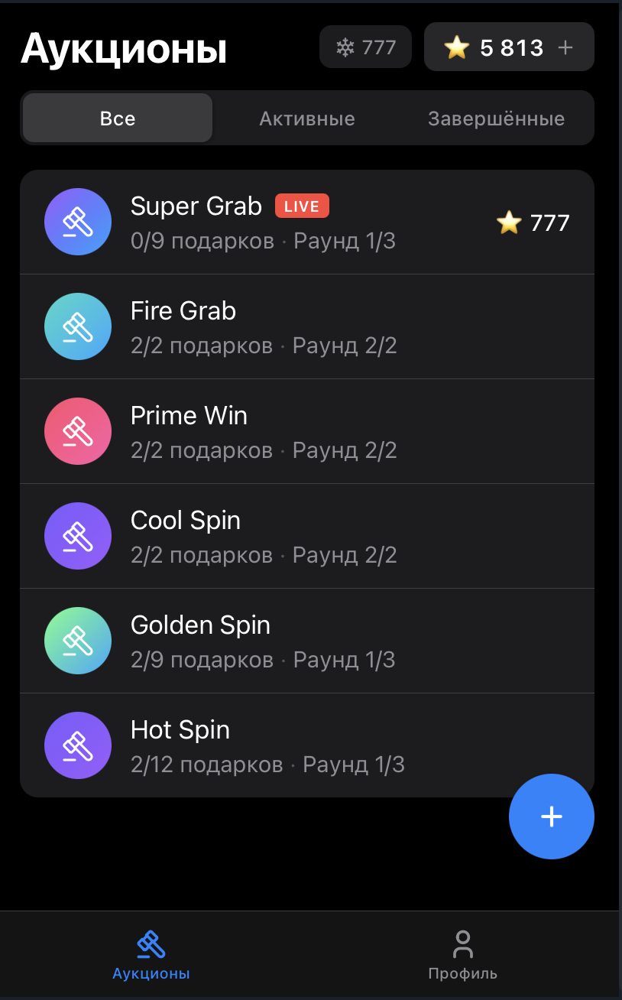
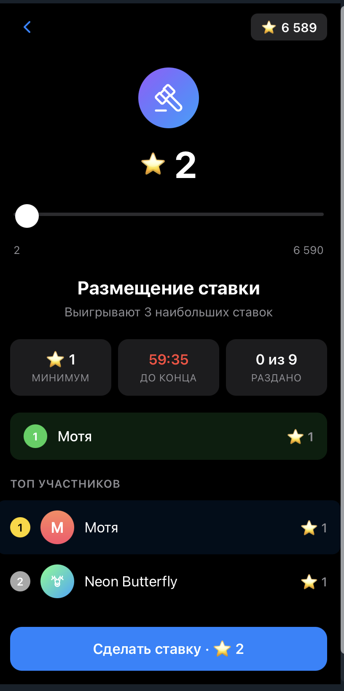
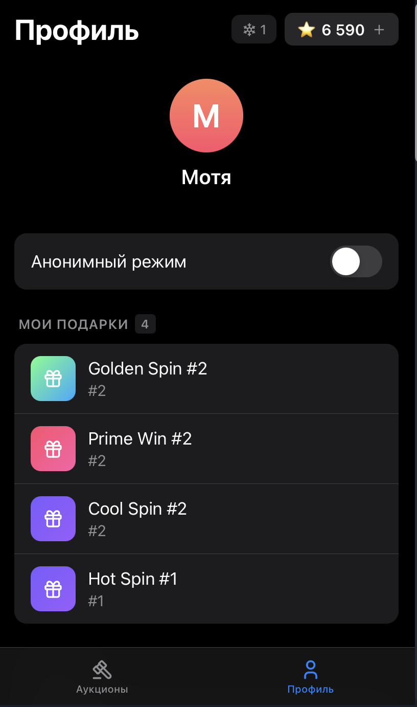

# Конкурсная работа tg-auction


Реализация механики многораундовых аукционов Telegram для конкурса Crypto Bot (январь 2026).

<p align="center">
  
  
  
</p>

## Проблема, которую решал Telegram

Представьте: вы запускаете продажу лимитированных подарков. Спрос превышает предложение в десятки раз. Боты скупают всё за миллисекунды. Живые пользователи не успевают. 

Первая попытка решения: ограничения по дате создания аккаунта. Помогло частично, но проблема осталась — **кто-то готов заплатить миллионы звёзд за топовый номер, а кто-то хочет просто успеть купить за разумную цену**.

Telegram пришёл к элегантному решению: **многораундовые аукционы**. 

Это не просто механика распределения дефицитных товаров — это **фильтр спроса**, где каждый находит свою цену. Кто-то заплатит 5 000 000 ⭐ за топ-5 номер в первом раунде. Другой дождётся финального раунда и купит за 2 900 ⭐.

Эта конкурсная работа — моя реализация этой механики.

---

## Что здесь главное

Три столпа, на которых стоит весь проект:

### 1. **Корректность логики**
Нет багов, которые мешают проверить работу. Каждый edge-case продуман и задокументирован:
- Что если участников меньше, чем подарков?
- Что если две ставки пришли в одну миллисекунду?
- Что если воркер упал во время финализации раунда?

### 2. **Финансовая безопасность**
Ноль толерантности к ошибкам с деньгами:
- Деньги удерживаются (**hold**), но не списываются до победы
- Все операции через `big.js` — никаких float-ошибок
- Транзакции MongoDB гарантируют атомарность
- Идемпотентность: повторный запрос не создаст дубликат

### 3. **Устойчивость к нагрузке**
Система спроектирована выдержать реальный продакшен:
- WebSocket для real-time обновлений без polling-ада
- Worker отделён от API — тяжёлые операции не блокируют пользователей
- Оптимистичные локи и идемпотентность для конкурентных операций

---

## Цель продукта (как я её вижу)

Не просто "раздать подарки". Telegram решал сразу четыре задачи:

1. **Распределить серию ограниченных подарков** — каждый получает номер
2. **Увеличить доход** — высокий спрос трансформируется в revenue через аукцион
3. **Снизить манипуляции** — anti-sniping защищает от снайперов, многораундовость от ботов
4. **Повысить вовлечённость** — каждый может участвовать, не нужно быть в первых миллисекундах

---

## Технический стек

### Обязательный стек (по условиям конкурса):
- **Node.js** + **TypeScript**
- **MongoDB** (Mongoose)

### Мой выбор сверху:
- **Hono** — fast, lightweight, built on Web Standards
- **Svelte 5** — для web UI (с новыми runes и реактивностью)
- **Vite** — молниеносная сборка (HMR)
- **pnpm** — менеджер пакетов с workspace support
- **big.js** — для финансов
- **tsx** — для dev режима с hot reload (без отдельной сборки)

> **Почему Svelte, а не React?** В продуктовой среде чаще выбирают React. Но это конкурсная работа без требований к фронтенду, и я хотел продемонстрировать работу с разными инструментами. Svelte 5 с новыми runes — демонстрация владения современными подходами к реактивности.

> **Почему pnpm? Потому что Workspaces.** Монорепа из 9 пакетов (4 apps + 5 packages). Все внутренние зависимости через `workspace:*` — изменения в `@tac/core` мгновенно видны в `@tac/api` без пересборки. Один `pnpm install` — все пакеты готовы. Один `pnpm dev` — всё стартует параллельно.

### Архитектура:
```
apps/                          packages/
  ├─ api/                        ├─ core/
  │   Hono API + WebSocket       │   Чистая бизнес-логика:
  │   deps: @tac/core, db,       │   - ranking алгоритмы
  │         shared, telegram     │   - валидация ставок
  │                              │   - anti-sniping rules
  ├─ worker/                     │   (только big.js, никаких фреймворков)
  │   Финализация раундов        │
  │   (отдельный процесс)        ├─ db/
  │   deps: @tac/core, db        │   Mongoose модели + транзакции
  │                              │   deps: mongoose, @tac/core
  ├─ bot/                        │
  │   Telegram Bot               ├─ shared/
  │   (Mini App entry point)     │   DTO + типы + контракты
  │   deps: @tac/telegram        │   (переиспользуется в api + web)
  │                              │
  └─ web/                        ├─ env/
      Svelte 5 UI                │   Конфиг + переменные окружения
      deps: @tac/shared          │
                                 └─ telegram/
                                     Валидация initData +
                                     Push-уведомления (grammy)
```

**Почему такая структура:**

1. **`@tac/core` — чистый**  
   Ноль зависимостей от фреймворков. Можно взять и использовать с Fastify, Express, Deno — что угодно. Вся бизнес-логика в одном месте.

2. **`@tac/shared` — один контракт для всех**  
   API и UI говорят на одном языке типов. Изменил DTO — ошибка компиляции сразу в обоих местах.

3. **Типизация end-to-end**  
   От базы данных → через core → в API → до UI. TypeScript проверяет каждый шаг.

4. **Независимые деплои**  
   Хочешь обновить только worker? Деплоишь только `@tac/worker`. API продолжает работать.

5. **DX**  
   Меняешь код в `@tac/core` → tsx автоматически перезапускает `api` и `worker`. Без ручных пересборок.

---

## Механика аукциона (как это работает)

### TL;DR
Аукцион состоит из **N раундов**. В каждом раунде выигрывают **top-K ставок** по сумме. Деньги **не списываются сразу** — они уходят в **hold** (удержание). Списание происходит только при победе. Проигравшим в финале удержание снимается.

### Жизненный цикл аукциона

```
Draft → Upcoming → Active → Completed
  ↓         ↓         ↓
создан   запланирован  идут раунды
```

1. **Draft**: аукцион создан, но не запущен
2. **Upcoming**: задан `start_at` в будущем → на экране **таймер обратного отсчёта**
3. **Active**: стартовал первый раунд, пользователи делают ставки
4. **Completed**: завершён последний раунд

### Конфигурация (что задаём при создании)

```typescript
{
  rounds_count: 3,              // Сколько раундов
  items_per_round: 10,          // Сколько подарков выигрывают в каждом
  first_round_minutes: 60,      // Первый раунд обычно длинный
  other_rounds_minutes: 5,      // Остальные — короткие
  min_bid: "100",               // Минимальная ставка (⭐)
  bid_step: "10",               // Шаг повышения
  anti_sniping: {
    threshold_seconds: 30,      // Если ставка top-K за 30 сек до конца...
    extension_seconds: 60,      // ...раунд продлевается на 60 сек
    max_extensions: 5           // Лимит продлений (0 = без лимита)
  },
  start_at: "2026-01-15T12:00:00Z"
}
```

**Почему конфиг такой?** В ранней версии я задавал "всего подарков + всего раундов", но появлялась математика вида "10 подарков / 3 раунда = 3.33". Это спорные правила округления. Поэтому здесь **зафиксировано K на раунд** — проще и понятнее.

### Как делает ставку пользователь

**Что видит пользователь в UI:**
- ⭐ — доступно для ставок (`balance`)
- ❄️ — заморожено под активные ставки (`hold`)

**Что происходит при ставке:**
1. Пользователь выбирает сумму (в ⭐)
2. Сервер проверяет:
   - Аукцион активен (`status: active`)
   - Раунд не закончился (`now < end_at`)
   - Сумма валидна по `min_bid` / `bid_step`
   - Хватает доступных средств
3. Если ставка повышается — удерживается **дельта**. Если первая — вся сумма
4. Пользователь получает в ответ:
   - Свою ставку (`bid`)
   - Актуальный раунд (`round`, включая `end_at`)
   - Обновлённый баланс

**Никаких списаний!** Деньги перемещаются из `balance` в `hold`. Финальное списание (capture) только при победе.

### Кто выигрывает: ранжирование и tie-breaker

В конце раунда выбираются **top-K победителей**. Порядок строгий и детерминированный:

1. **amount** (по убыванию) — больше ставка = выше место
2. **amount_reached_at** (по возрастанию) — кто раньше достиг суммы = выше
3. **bid_id** (по возрастанию) — fallback для полного равенства (детерминизм)

**Почему это важно?** Без fallback порядок при равных ставках недетерминирован. Это означает, что при ретраях/пересчётах могут выиграть разные люди. Недопустимо.

### Anti-sniping (продление раунда)

Механика против снайперов — тех, кто ставит в последнюю секунду.

**Алгоритм:**
- Если ставка **после пересчёта** попала в top-K
- И до конца раунда осталось меньше `threshold_seconds`
- Раунд продлевается на `extension_seconds`

**Важно:** продление делается атомарно через условный update, чтобы при конкурирующих ставках не "терять" продления и не ломать лимиты.

```typescript
// Псевдокод
Round.findOneAndUpdate(
  { 
    _id: roundId, 
    extensions_count: { $lt: max_extensions } 
  },
  { 
    $inc: { extensions_count: 1 },
    $set: { end_at: newEndAt }
  }
)
```

### Что происходит в конце раунда (Worker)

Финализацию делает отдельный **worker** (не API). Почему? Это тяжёлая операция, и она должна быть устойчивой к падениям.

**Алгоритм финализации:**

1. **Лок раунда**: статус `active` → `finalizing` (условный update, чтобы два воркера не схватили один раунд)
2. **Выбор победителей**: ранжируем ставки, берём top-K
3. **Для каждого победителя** (транзакционно):
   - Назначается подарок (`Gifts.findOneAndUpdate({ owner_id: null })`)
   - Ставка → `status: won`
   - **Capture**: `hold -= amount` (деньги уже были перенесены из balance в hold при ставке)
   - Запись в ledger (`type: capture`)
4. **Если есть следующий раунд:**
   - Проигравшие переносятся: их ставки → `status: transferred`
   - Создаются новые ставки в следующем раунде с той же суммой
   - Аукцион → `current_round = next_round_number`
5. **Если раунд последний:**
   - **Release**: `hold -= amount`, `balance += amount` (возврат денег)
   - Ставки → `status: refunded`
   - Аукцион → `status: completed`

**Ключевой момент:** победитель **может участвовать снова** в следующем раунде и выиграть ещё один подарок. Это соответствует механике Telegram Gift Auctions — один пользователь может получить несколько подарков, если у него достаточно средств и желания продолжать торги.

### Real-time обновления (WebSocket)

Во время раунда клиенты получают события:
- `bid` — новая ставка (обновление лидерборда)
- `round_extended` — раунд продлён из-за anti-sniping
- `pong` — keepalive

Когда таймер доходит до `0:00`, UI делает короткий polling, пока воркер не обработает раунд — **чтобы интерфейс не "залипал"**.

### Push-уведомления (Telegram Bot)

Критичные события отправляются пользователю напрямую в Telegram:

| Событие | Текст | Кнопка |
|---------|-------|--------|
| **Победа** | `Вы выиграли Gift #N в аукционе «Name»!` | Открыть профиль |
| **Возврат** | `Аукцион завершён. Ваша ставка X возвращена.` | Аукционы |
| **Перенос** | `Раунд N завершён! Вы переходите в раунд N+1.` | Открыть аукцион |
| **Перебили** | `Вас перебили! Вы вне топ-K.` | Поднять ставку |

Реализация через `grammy` в пакете `@tac/telegram`. Уведомления отправляются из Worker (победа, возврат, перенос) и API (перебили).

---

## Недостаточно участников

**Проблема:** в Telegram такого не поймать — тысячи юзеров. Но в тестовой среде что делать, если участников меньше, чем подарков в раунде?

**Решение:** аукцион раздаёт все подарки в раунде и завершается с пометкой `распродано X из Y`. 

(При продаже [UFC Strike](https://t.me/auction/ufcstrike) минимальная ставка была ⭐ 250 — я считаю, что Telegram в случае недостаточного спроса переключал продажу на обычный гифт без аукциона. Здесь это не реализовано — не является частью механики.)

---

## Как проверить работу

### Быстрый старт

```bash
# 1. Установить зависимости
pnpm install

# 2. Запустить всё через Docker
docker compose up -d --build

# 3. Открыть бота в Telegram
# /start → "Открыть аукцион"
```

### Что внутри?

```bash
# API (порт 3000)
pnpm --filter @tac/api dev

# Worker (финализация раундов)
pnpm --filter @tac/worker dev

# Bot (Telegram Mini App entry point)
pnpm --filter @tac/bot dev

# Web UI (порт 5173)
pnpm --filter @tac/web dev
```

### Для разработки (с ngrok)

Telegram Mini App требует HTTPS. Для локальной разработки:

```bash
# Пробросить Web наружу (API проксируется через Vite)
ngrok http 5173

# Обновить .env
WEBAPP_URL=https://xxxx.ngrok-free.app/
```

> **Vite Proxy:** все запросы к `/api` автоматически проксируются на `localhost:3000`, поэтому достаточно одного ngrok на Web.

### Тесты

```bash
# Запустить все тесты
pnpm test

# Unit тесты @tac/core
pnpm --filter @tac/core test

# Integration тесты API
pnpm --filter @tac/api test
```

**Что покрыто тестами (99 тестов):**

| Пакет | Тип | Покрытие |
|-------|-----|----------|
| `@tac/core` | Unit (65) | Wallet operations (hold/release/capture), bid validation, ranking, tie-breaker, anti-sniping logic |
| `@tac/api` | Integration (34) | Auction CRUD, bidding flow, balance/hold checks, leaderboard, winners selection, round extensions, **round finalization (capture/refund/transfer)**, edge cases (zero bidders, early completion, multiple wins) |

> **Почему Vitest?** Быстрый, нативный ESM, отличный DX из коробки. Integration тесты используют `mongodb-memory-server` с replica set для поддержки транзакций.

### Нагрузочное тестирование

```bash
pnpm dev:api
pnpm dev:worker
pnpm load-test
```

777 ботов, 5 раундов по 15 сек. Все ставки приходят в последнюю секунду — worst case для anti-sniping и конкурентности.

После каждого раунда скрипт проверяет:
- throughput (ставок/сек)
- anti-sniping сработал
- победители получили gifts
- деньги списались/вернулись корректно

---

## Ограничения текущей версии

Проект демонстрирует механику аукционов, но не включает production-инфраструктуру:

- **Масштабирование** — horizontal scaling, sharding, Redis-кеширование
- **Messaging** — брокер сообщений между Worker и API (см. ниже)
- **Защита** — rate limiting, IP throttling
- **Мониторинг** — Prometheus, Grafana, Sentry

### CORS Policy

API использует `origin: '*'` — это **специально** для Telegram Mini App. Чтобы упростить запуск локально:

1. **Основная защита — initData**. Каждый запрос содержит подписанный Telegram initData с ограниченным TTL. Без валидной подписи запрос отклоняется.
2. **Данные аукционов публичны**. Лидерборд, ставки, состояние — не секретная информация. Чувствительные операции (ставка, старт) защищены initData.

### WebSocket и Worker

Worker (финализация раундов) и API — отдельные процессы. Worker не может напрямую отправить WebSocket события клиентам.

**Текущее решение:** Фронтенд делает polling после окончания таймера раунда (0:00) до получения нового состояния. Это работает и не влияет на корректность.

**Production решение:** Добавить Pub/Sub между Worker и API:
1. Worker публикует `round_ended` / `auction_completed`
2. API подписывается и пробрасывает события через WebSocket

Для конкурса polling достаточен — фокус на другом.

---

## Контакты

[](https://t.me/dyadyamotya95)
